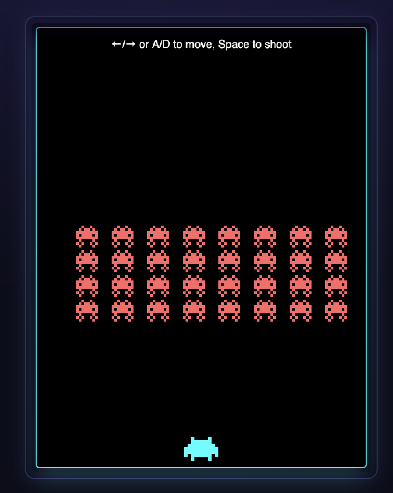

# WebRacket

The WebRacket language is a subset of Racket that compiles to WebAssembly (wasm).

The long-term goal is to support full Racket.
However, to quote Piet Hein, “Things take time.”

The subset supported by the WebRacket compiler is large enough
to enable programmers to build practical programs for the web.

The generated WebAssembly can be run either in the terminal (via Node) or in the browser.
The browser is the main focus.
WebAssembly is somewhat of a moving target.
The compiler only uses widely supported features of WebAssembly. 
Expect the generated code to work in Chrome, Firefox and Safari.

A JavaScript FFI makes it possible to use standard JavaScript functions as well as browser-specific APIs.
Included are bindings for the DOM, Canvas, MathJax, XTermJS and JSXGraph.

The hope is that this project allows the Racket community to experiment with WebAssembly.
The ideal outcome is that the experience can be used to extend the normal Racket compiler
with a WebAssembly backend. In the meantime, we can have fun writing Racket programs
that run in the browser.

# Is WebRacket for you?

If you want to develop Racket programs that run in the browser and 
want to avoid JavaScript, then WebRacket is for you.

The FFI allows you to use WebRacket functions as event callbacks 
on the JavaScript side.

See `examples/` for a few WebRacket projects.

# Overview of the supported language subset

The WebRacket compiler accepts a file containing a top-level form as input.
The `module` form is not supported. However, `include` is available.

For supported data types most functions in `racket/base` and `racket` 
are available as primitives. Most are implemented directly in WebAssembly,
some are reimplemented in WebRacket.

## Datatypes
Most basic data types are implemented, some have restrictions.

### Numbers
The numerical tower contains only flonums and fixnums.
Complex numbers and bignums are missing.

### Hash Tables
Mutable hash tables of all four varieties (`eq?` `eqv?` `equal?` `always?`) are supported.
The values of all mutable hash tables are strongly held, even for tables created by the weak constructors.

Immutable hash tables are not yet supported.

### Regular Expressions
No direct support for regular expressions at the moment.
These will materialize once support for linklets and modules improves.

### Ports
Since the main target is the browser, only string (and byte string) ports are supported.
If there is interest for file ports (for the terminal), let me know.

### Structures
Most structure related bells and whistles are implemented including super structures, 
structure properties and applicable structures. 
The most notable missing feature is prefab structures.

## Syntactic Forms

The WebRacket compiler uses the standard Racket expander, so a large number
of syntactic forms are supported. This includes `for` and `match`.

Most notable omissions are the forms `module`, `module*` and `with-continuation-mark`.

## Control Flow

Tail calls are supported.
Multiple values are supported.
Upward flowing exceptions are supported.

Continuations and continuation marks are not supported.
In particular, there is no support for `call/cc`  (sorry Shriram).

Other omissions: promises, breaks, exit and black box.

## Concurrency and Parallelism

Single-threaded for now.

## Foreign Function Interface

The JavaScript foreign function interface is used to access browser functionality.
The hope is that the community will help write bindings for commonly used libraries.
To some degree the generation of foreign function interfaces can be automated
with the help of an LLM.

Included bindings currently cover the Math, DOM, Canvas, MathJax, XTermJS, and JSXGraph.

# The Road Ahead

After the initial release, the focus is to fix bugs found by early adopters.

Then the top priority is to support modules.
Work on implementing linklets (needed to support modules) has already started.

Due to my personal interests, complex numbers and bignums are likely to appear
sooner rather than later.

Impersonators and chaperones are needed to support contracts.

Unlocking modules (and linklets) will also unlock the full implementation of 
regular expressions present in the source of the Racket expander.

Support for continuations and continuation marks, although high on the wish list,
is something that is trickier to implement given the nature of the target.
Last resort is to add a CPS pass to the compiler.

# Installation - short version

You need:

- wasm-tools from the Bytecode Alliance (version 1.243.0 or newer)
- Node.js (recent version; needs to support --experimental-wasm-exnref)
- Racket 9.0
- raco-static-web
- a clone of the `webracket` repo

# Installation

The WebRacket compiler depends on two external programs: `wasm-tools` and `node`.

The `wasm-tools` project by Bytecode Alliance consists of a suite of WebAssembly tools.
WebRacket uses the `wasm-tools` to compile WebAssembly source files (.wat)
(in S-expression format) to bytecode (.wasm).

Node (or Node.js) is a JavaScript runtime environment used to run JavaScript programs in the terminal. 
WebRacket uses Node to run programs directly in the terminal. 
This is useful for testing programs that do not depend on browser functionality.
A relatively new version is needed. 

When the target is the browser, the WebRacket compiler can optionally produce
an html file that loads the generated WebAssembly program. In order to test
locally, the package `raco-static-web` by Sam Philips is very convenient.

## wasm-tools

1. Download the latest release from:

       https://github.com/bytecodealliance/wasm-tools/releases

2. Unpack the tar-ball:

       tar -xvf wasm-tools-1.243.0-aarch64-macos.tar.gz

3. Open `README.md` in the browser to see further instructions.

4. Make sure to place `wasm-tools` somewhere in your PATH.
   On macOS, you can do it with:
   
       sudo mv wasm-tools /usr/local/bin/

5. Test that `wasm-tools` works:

       wasm-tools

Depending on security settings, you might get a dialog on macOS.
If so, open the system preferences and find the "Privacy and Security" tab.
Then allow `wasm-tools` to run

## Node.js

1. Go to https://nodejs.org/en/download and follow the instructions.

2. Test that `node` works in the terminal (and that it is in your path).

       node

WebRacket needs support for `exnref` so your Node version needs
to accept the `--experimental-wasm-exnref` flag.

Here is what I see, when Node is started:

    % node --experimental-wasm-exnref --expose-gc
    Welcome to Node.js v24.9.0.
    Type ".help" for more information.

## Racket 

The compiler needs Racket 9 or newer.

## raco-static-web

1. Install the web-server using `raco`.

       raco pkg install raco-static-web

2. Test it works. Go to a folder that holds an HTML file.
   Then start the web-server with:
   
       raco static-web

   Follow the printing instructions.

## Short Compiler Overview

The WebRacket compiler is a direct-style compiler.
This choice has made it easier to relate the generated code to the source program.
In the future we will probably need to add a CPS-pass in order to support
continuations and continuation marks.

The frontend of the WebRacket compiler uses `read-syntax` to read 
a WebRacket program from a file. The resulting syntax object is fed
into the normal Racket expander to produce a program in fully expanded form.

The middle end of the compiler consists of several passes implemented
using the NanoPass framework.

The passes are as follows:

    unexpand
    parse
    flatten-topbegin
    infer-names
    convert-quotations
    explicit-begin
    explicit-case-lambda
    α-rename
    assignment-conversion
    categorize-applications
    anormalize
    closure-conversion
    flatten-begin
    (classify-variables)
    generate-code

See the comments in "compiler.rkt" for an explanation of each pass.

The code generator generates WebAssembly in the form of S-expressions
in the "folded" format.

This code generator is inspired by "Destination-driven Code Generation"
by Dybvig, Hieb and Butler. There are some differences, however. The code
generator in the paper generates "flat" code (assembler) whereas we
generate nested WebAssembly instructions.

Finally, the external tool `wasm-tools parse` converts the S-expression
representation into bytecode format.

The main part of the compiler is in "compiler.rkt".
The WebAssembly runtime is in "runtime-wasm.rkt".
The standard library (implemented in WebRacket) is found in `stdlib/`.
FFI bindings for popular libraries are in `ffi/`.

It has been a design goal to avoid relying on functionality provided
by the WebAssembly host if possible. Who knows - maybe someone needs
a non-JavaScript host at some point? For browser functionality there
is no way around interfacing with the JavaScript host. The JavaScript
part of the runtime support is in `assembler.rkt`. 

# Examples

The folder `examples/` contains a few examples that show different 
aspects of WebRacket. 

Examples include:
- MathJax 4 two-pane editor/preview
- Matrix digital rain
- MiniScheme REPL
- pict port
- Space Invaders
- xtermjs demo

## Running the examples

1. Go to the `examples/` folder
2. Start a local web-server

    raco static-web
    
3. Open  http://localhost:8000/  in your favorite browser.
4. Click on a folder and then click the HTML file.

## examples/mathjax4

The JavaScript library MathJax allows web page authors to use 
mathematical formulas on their web pages. 

The MathJax example allows you to experiment with the
newest version, namely MathJax 4.

The page will load MathJax 4 from a CDN (content delivery network).
The user is then presented with a simple two-pane editor/preview interface.
Any LaTeX formula entered on the left, is rendered and displayed on the right.

The implementation is in one file "mathjax4.rkt".

Given html in the form of an S-expression, the program dynamically
generates a web page with an "Input Pane" and a "Preview Pane".
An event handler is attached to the input pane, such that the 
WebRacket function `update-preview-handler` is called each time
there are changes in the input pane.

This example demonstrates how to use `js-var` and `js-send` to get
access to the JavaScript object `MathJax` and how to invoke methods
such as `typesetPromise`.

  

## examples/matrix-rain

The movie "Matrix" by the Wachowskis featured a neat effect known
as "Digital Rain".

    https://en.wikipedia.org/wiki/Digital_rain
    
The effect shows constantly falling characters, mostly green,
falling down the screen.

The example uses the library `xterm.js` which emulates a
terminal in the browser.

The demo highlights WebRacket's bindings for external JS libraries,
terminal control through the XtermJS FFI, and real-time animation
using browser callbacks.

  

Improvements to this example are welcome.

## examples/minischeme

MiniScheme provides an interactive Scheme REPL.

There are two parts to this example.

A small "Scheme" interpreter handles reading and evaluation of the user input.
Large parts of the editor are implemented to make the REPL tolerable to use.
The terminal itself is backed by `xterm.js`.

Improvements to this example are welcome.

  

## examples/pict

This is a port of the picture library `pict`.

  

## examples/space-invaders

Space Invaders is a 1978 shoot'em up video game.

The example uses a 2D canvas to render the playing area.
It sets up the canvas and styles entirely from WebRacket, tracks game
entities with mutable structs, handles keyboard input for movement and
shooting, and drives gameplay with a `requestAnimationFrame` loop. The
game illustrates WebRacket's canvas bindings, event handling for user
input, and stateful animation of sprites in a browser environment.

  

## examples/xtermjs-demo

The XtermJS Demo recreates the interactive terminal shown on the
xterm.js homepage. 

It constructs the page layout and styling with DOM operations,
initializes an xterm.js instance with theme options, registers
add-ons, and routes user input to a set of built-in demo commands. 

It demonstrates styling and layout via WebRacket's DOM FFI, deep
terminal control through the XtermJS bindings, and integration of JS
add-ons from Racket code.

  

